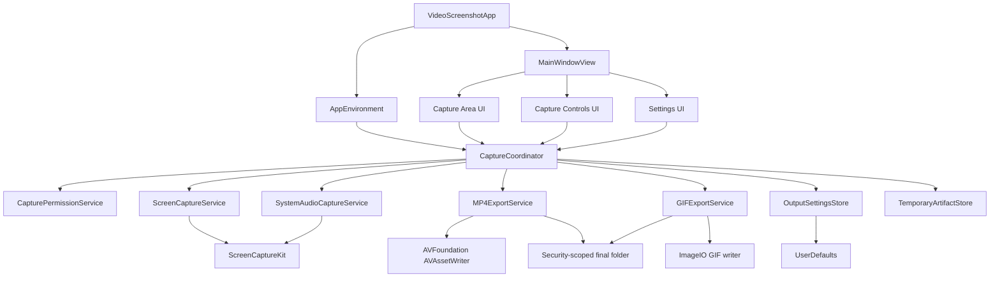
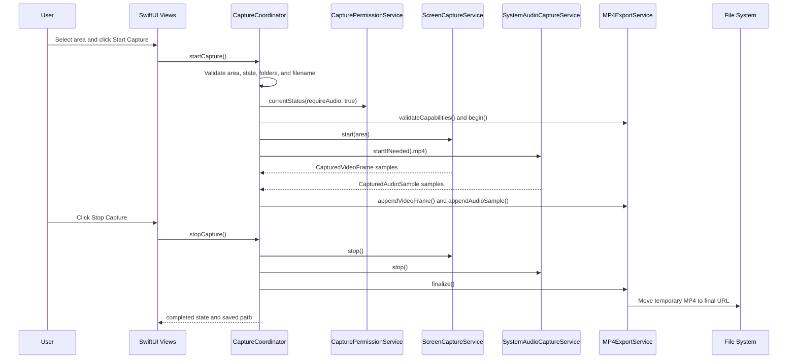

# Architecture

## System Overview

VideoScreenshot is a native macOS SwiftUI application for selecting a screen region, recording it at 24 frames per second, and exporting the recording as either an MP4 file or an animated GIF. The product scope is local desktop capture only. There is no backend service, network API, database, or cloud deployment path in the current implementation.

The application uses a layered, dependency-injected monolith. SwiftUI views own presentation and user interaction. `CaptureCoordinator` is the main workflow orchestrator and owns capture state, output settings, errors, and saved recording metadata. Capture services wrap ScreenCaptureKit, export services wrap AVFoundation and ImageIO, and small model/value types define the business entities passed between layers.

The architecture emphasizes safe local file handling. User-selected folders are accessed with security-scoped bookmarks, folders are validated before capture starts, temporary output files are committed atomically to final destinations, and finalization errors preserve temporary artifacts where possible.

## Component Diagram



### Component Responsibilities

| Component | Responsibility | Primary source |
|-----------|----------------|----------------|
| `VideoScreenshotApp` | Creates the app environment and main window. | `VideoScreenshot/App/VideoScreenshotApp.swift` |
| `AppEnvironment` | Wires live service implementations into the coordinator. | `VideoScreenshot/App/AppEnvironment.swift` |
| `CaptureCoordinator` | Orchestrates area selection, validation, permissions, capture start/stop, export routing, finalization, status, and errors. | `VideoScreenshot/Capture/CaptureCoordinator.swift` |
| `ScreenCaptureService` | Captures selected screen frames with ScreenCaptureKit at 24 fps and drops incomplete or backpressured frames. | `VideoScreenshot/Capture/ScreenCaptureService.swift` |
| `SystemAudioCaptureService` | Captures default system output audio for MP4 exports, excluding the current process and microphone. | `VideoScreenshot/Capture/SystemAudioCaptureService.swift` |
| `MP4ExportService` | Writes HEVC video plus AAC audio into an MP4 using AVAssetWriter and commits a temporary sibling file to the final URL. | `VideoScreenshot/Export/MP4ExportService.swift` |
| `GIFExportService` | Buffers video frames in memory and writes a silent looping GIF with ImageIO. | `VideoScreenshot/Export/GIFExportService.swift` |
| `OutputSettings` | Stores format, folder, filename, overwrite policy, bookmarks, and validation behavior. | `VideoScreenshot/Export/OutputSettings.swift` |
| `OutputSettingsStore` | Persists settings as JSON in UserDefaults and resolves security-scoped bookmarks on load. | `VideoScreenshot/Export/OutputSettingsStore.swift` |
| `OutputFileNamer` | Sanitizes final names, handles duplicate output policies, creates temporary sibling URLs, and commits final files. | `VideoScreenshot/Export/OutputFileNamer.swift` |

## Technology Stack

| Category | Technology | Purpose |
|----------|------------|---------|
| Language | Swift 6.0 project setting | Application source and tests. |
| UI framework | SwiftUI | Main window, controls, settings, status presentation. |
| Platform | macOS 26.0 deployment target | ScreenCaptureKit and current macOS capture APIs. |
| Screen/audio capture | ScreenCaptureKit | Screen frame capture and system audio capture streams. |
| Media writing | AVFoundation AVAssetWriter | MP4 container, HEVC video, AAC audio. |
| GIF writing | CoreImage and ImageIO | Convert captured frames to CGImage and encode animated GIFs. |
| Persistence | UserDefaults and security-scoped bookmarks | Save output settings and selected folder access. |
| Build configuration | Xcode project plus XcodeGen `project.yml` | Defines targets, signing, deployment target, entitlements, and tests. |
| Tests | XCTest and Xcode UI tests | Unit and UI test bundles. |
| Security | App Sandbox, hardened runtime, user-selected read/write entitlement, audio-input entitlement | Local macOS app security boundary and folder access. |

## Design Decisions

### Decision 1: Use `CaptureCoordinator` as the workflow boundary

- Decision: Keep capture workflow state and service orchestration in one `@MainActor` coordinator.
- Rationale: SwiftUI views can bind to published state while capture/export services remain focused on media or file operations.
- Alternatives considered: Put capture logic directly in views, or split orchestration across multiple view models.
- Consequences: The user flow is easy to trace and test, but the coordinator is the central integration point and should be kept small by moving pure media/file logic into services.

### Decision 2: Capture screen and system audio through separate ScreenCaptureKit streams

- Decision: `ScreenCaptureService` captures video frames and `SystemAudioCaptureService` captures audio samples independently.
- Rationale: GIF export needs video only, MP4 export needs video plus audio, and separate services make format-specific routing explicit.
- Alternatives considered: A single combined capture service.
- Consequences: Start/stop sequencing must clean up both services on failed starts, and samples are coordinated in `CaptureCoordinator`.

### Decision 3: Use security-scoped folders and temporary sibling files

- Decision: Persist user-selected folder bookmarks, validate folders with write probes, write to hidden temporary sibling files, and move temporary files into place on success.
- Rationale: macOS sandboxed apps require explicit user-selected folder access. Temporary sibling files reduce data loss and avoid partially written final files.
- Alternatives considered: Write directly to final output URLs or only use the app container.
- Consequences: User folder access is durable and safer, but bookmark resolution and scoped access must be maintained.

### Decision 4: Export MP4 with HEVC video and AAC audio

- Decision: Current code validates and writes HEVC/H.265 video plus AAC audio in an MP4 container.
- Rationale: AVAssetWriter supports this combination on macOS and can validate writer capabilities before recording starts.
- Alternatives considered: MP3 audio in MP4 as originally described by the product input.
- Consequences: The implementation differs from the original MP3 wording. User and deployment documentation should describe the actual AAC implementation unless the encoder is changed.

### Decision 5: Buffer GIF frames in memory with explicit limits

- Decision: GIF export stores frames as CGImages and enforces maximum frame and pixel counts.
- Rationale: GIF generation through ImageIO needs frame access during finalization, and explicit limits prevent runaway memory use.
- Alternatives considered: Stream GIF frames incrementally to disk.
- Consequences: GIF is suitable for short recordings or small regions. Longer captures should use MP4.

## Directory Structure

```text
VideoScreenshot/
  project.yml                         # XcodeGen target, signing, deployment, and entitlement settings
  VideoScreenshot.xcodeproj/           # Generated Xcode project
  VideoScreenshot/                     # Application source
    App/                               # App entry point and dependency wiring
    Capture/                           # Capture workflow, permission, state, and ScreenCaptureKit services
    Export/                            # Output settings, naming, artifact, MP4, GIF, and saved recording logic
    RegionSelection/                   # Capture area models, display geometry, selection overlay, selection view model
    UI/                                # SwiftUI main window, settings, controls, status, and cards
    Assets.xcassets/                   # App icons and asset catalog
    Info.plist                         # Bundle metadata and usage descriptions
    VideoScreenshot.entitlements       # App Sandbox, user-selected files, audio input
  VideoScreenshotTests/                # Unit tests for settings, naming, errors, capture state, region selection
  VideoScreenshotUITests/              # UI tests for capture controls
  specs/001-screen-capture-export/     # Spec Kit feature specification, plan, contracts, quickstart, QA, and tasks
  .sdd/docs/                           # Generated application documentation
```

## Data Flow

### Capture and MP4 Export Flow



### GIF Export Flow

The GIF path shares area selection, validation, and screen capture with MP4. When output format is GIF, audio capture is stopped or skipped, video frames are converted to CGImages, bounded in memory, then finalized through ImageIO as a silent looping GIF.

### Settings Persistence Flow

`SettingsView` mutates `coordinator.outputSettings`. Folder picker selections call `setTemporaryFolder` or `setFinalOutputFolder`, which store security-scoped bookmark data. `saveSettings()` persists the full settings object as JSON through `OutputSettingsStore`. On app start, the store decodes settings and resolves bookmarks before the coordinator uses them.


## Source Evidence

This document is based on:

- Codebase-memory MCP project `Volumes-WDBlack4TB-Code-VideoScreenshot`: index status ready, 885 nodes, 1350 edges.
- Codebase-memory MCP graph searches for Capture, Export, and Settings components.
- Codebase-memory MCP trace_path results for `start`, `stop`, `CaptureCoordinator`, `ScreenCaptureService`, `SystemAudioCaptureService`, `MP4ExportService`, `GIFExportService`, and `OutputSettingsStore`.
- Source files under `VideoScreenshot/App`, `VideoScreenshot/Capture`, `VideoScreenshot/Export`, `VideoScreenshot/RegionSelection`, and `VideoScreenshot/UI`.
- Spec Kit files under `specs/001-screen-capture-export/`.
- Verification log `/tmp/videoscreenshot-xcodebuild-test.log`, which contains one `** TEST SUCCEEDED **` marker and no build/test error markers in the parsed verification pass.
